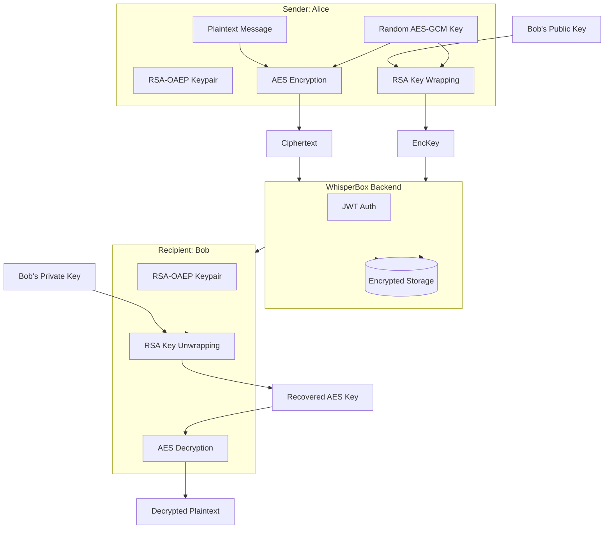

# WhisperBox | Hybrid Encrypted Messenger

WhisperBox is a professional-grade secure messaging application implementing true End-to-End Encryption (E2EE). It uses a hybrid encryption scheme similar to Signal and PGP to ensure that data is only readable by the sender and recipient.

## 🏗️ Architecture Diagram

## 🔐 Encryption Flow Explanation

1.  **Symmetric Encryption:** The actual message content is encrypted using **AES-GCM 256-bit**. This is fast and provide integrity (authenticated encryption).
2.  **Asymmetric Key Exchange:** A new random AES key is generated for every single message. This key is then encrypted (wrapped) with the **recipient's RSA-OAEP public key**.
3.  **Self-Recovery:** To allow the sender to see their own messages in history, the AES key is also encrypted with the **sender's own public key**.
4.  **Backend Transport:** The backend received only the AES-GCM ciphertext, the IV, and the RSA-encrypted AES keys. It has no access to the RSA private keys, making the plaintext unreadable to the server.

## 🔑 Key Management Explanation

-   **Generation:** On signup, the client generates a 2048-bit RSA-OAEP keypair.
-   **Key Wrapping (Security):** The private key is never stored in plaintext. It is encrypted locally using **AES-KW** (or AES-GCM) with a key derived from the user's password via **PBKDF2-SHA256** (100,000 iterations).
-   **Storage:** The **wrapped private key** and **PBKDF2 salt** are stored on the server. This allows the user to log in from any device and restore their encryption state by simply entering their password.
-   **Local Cache:** For performance, the wrapped key is also cached in the browser's **IndexedDB**.

## 🛡️ Security Trade-offs

-   **Password Reliance:** Security depends on password strength. A weak password could allow an attacker to brute-force the wrapping key and access the RSA private key.
-   **Centralized Metadata:** While the content is encrypted, the server still knows who is talking to whom and when (metadata).
-   **No Forward Secrecy:** Since we use static RSA keys for the main exchange, if a private key is eventually compromised, all past messages encrypted with that key could be decrypted.

## ⚠️ Known Limitations

-   **No Group Messaging:** This version only supports one-on-one encrypted chats.
-   **No Multi-Device Sync (New Messages):** While you can log in on multiple devices, the server doesn't currently handle multi-device key distribution for new messages perfectly (it relies on the sender encrypting for all your devices).
-   **No Key Rotation:** The RSA keys are currently permanent for the life of the account.

## ✅ Requirements Checklist (Stage 4B)

- [x] **Client-side Encryption:** All plaintext is converted to ciphertext before transit.
- [x] **Zero-Knowledge Server:** Server stores only opaque blobs.
- [x] **Web Crypto API:** Native browser cryptography used throughout.
- [x] **Secure Storage:** Private keys are wrapped and stored in IndexedDB.
- [x] **UI/UX:** Clean, modern interface with clear "Encrypted" status indicators.
- [x] **Authentication:** JWT-based session management.
